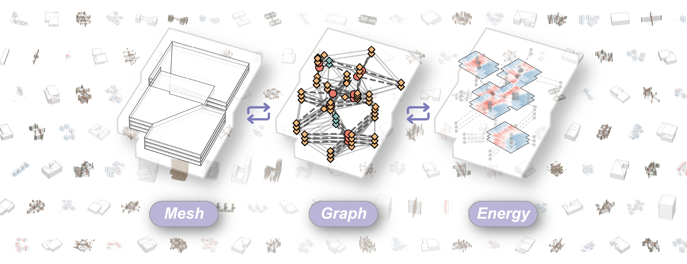
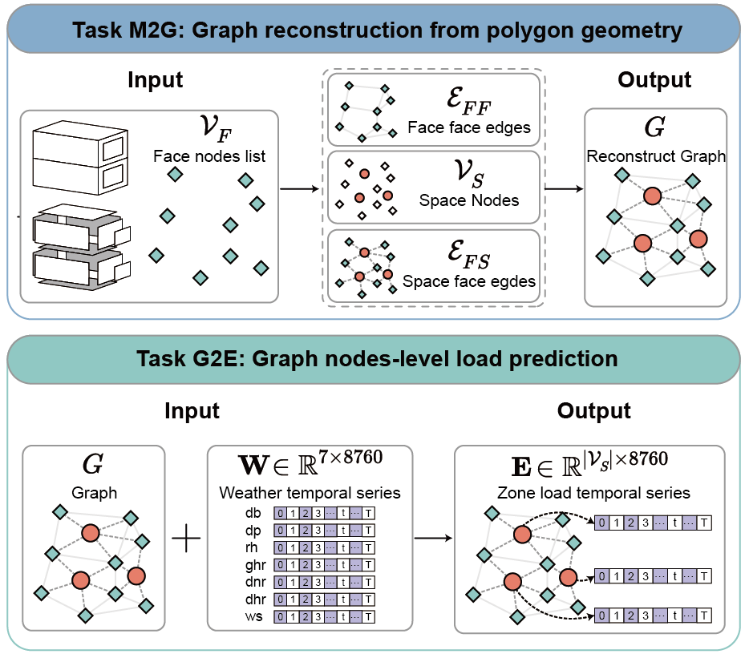

<p align="center">
	
</p>




<p align="center">
	<a href="https://github.com/ArchEGraph/ArchEGraph" style="display:inline-block;">
		
	</a>
	<a href="https://huggingface.co/datasets/ArchEGraph/ArchEGraph" style="display:inline-block;">
		
	</a>
</p>

# ArchEGraph

This is the official codebase for the paper:  
**ArchEGraph: A Large-Scale Graph Dataset for Geometry–Topology–Physics Aligned Building Energy Modeling** .

Minimal and reproducible training code for ArchEGraph dataset experiments.


## Overview

- mesh2graph: reconstruct topology-related structure from geometry and building features.
- graph2energy: predict energy from graph and weather features.
- Unified CLI entry at main.py.
- Reproducibility controls (seed, deterministic mode).

<p align="center">
	
</p>

## Repository layout

```text
ArchEGraph/
	main.py
	requirements.txt
	asset/
	configs/
		mesh2graph.minimal.json
		graph2energy.minimal.json
	scripts/
		run_mesh2graph.sh
		run_graph2energy.sh
		reproduce_minimal.sh
	mesh2graph/
	graph2energy/
	cache/                  # generated artifacts (ignored by git)
```

## Environment

Python 3.10+ is recommended. CUDA is optional but recommended for full-scale training.

```bash
pip install -r requirements.txt
```

If your machine needs a specific PyTorch/CUDA build, install PyTorch first from the official index, then run the command above.

## Dataset setup from HuggingFace

The dataset is not included in this repository.

1. Download dataset from HuggingFace: https://huggingface.co/datasets/ArchEGraph/ArchEGraph
2. The verified default HuggingFace layout (after `huggingface-cli download ... --local-dir ./data`) is:

Expected layout for direct training:

```text
data/
	manifest.csv
	building/*.npz
	geometry/*.npz
	weather/*.npz
	energy/**/*.npz
	split/
		split_m.csv				# Get the ArchEGraph-M dataset with this split 
		split_p.csv				# Get the ArchEGraph-P dataset with this split
		split_demo.csv 			# Minimal split for quick start
		split_building_bias.csv # Dataset split for cross-building generalization experiment
		split_weather_bias.csv  # Dataset split for cross-weather generalization experiment
```

This layout is consistent with the current HuggingFace dataset tree (`building`, `energy`, `geometry`, `weather`, `split`, `manifest.csv` at the dataset root).

You can download with HuggingFace CLI:

```bash
pip install hf
hf auth login

# Download main dataset to ArchEGraph/data (default layout)
hf download ArchEGraph/ArchEGraph --repo-type dataset --local-dir ./data
```

Important: `ArchEGraph` is very large (Currently about 34.2GB on HuggingFace).

If you want a fast quick-start, use the demo dataset:

- https://huggingface.co/datasets/ArchEGraph/ArchEGraph-demo
- size is currently about 234MB
- it is extracted based on `split_demo`

Quick-start commands for demo:

```bash
# 1) Download the small demo data package
hf download ArchEGraph/ArchEGraph-demo --repo-type dataset --local-dir ./data_demo

# 2) Download split_demo.csv only (small file) from the main dataset
hf download ArchEGraph/ArchEGraph --repo-type dataset --include "split/split_demo.csv" --local-dir ./data_demo
```

## Quick start

After placing data under `data`, run:

```bash
bash scripts/run_mesh2graph.sh --data_dir ./data/ --split split_m_mesh

bash scripts/run_graph2energy.sh --data_dir ./data/ --split split_p
```

For graph2mesh (mesh2graph) runs, use split files with the `_mesh` suffix.

Examples:

```bash
# split name
bash scripts/run_mesh2graph.sh --data_dir ./data/ --split split_demo_mesh

# or csv file name/path
bash scripts/run_mesh2graph.sh --data_dir ./data/ --split split/split_demo_mesh.csv
```

Run both sequentially:

```bash
bash scripts/reproduce_minimal.sh
```

Override any option from CLI, for example:

```bash
python main.py --task graph2energy --config configs/graph2energy.minimal.json --data_dir ./data/ --split split_p
```

`--split` accepts split name (`split_m`, `split_p`, `split_m_mesh`), file name (`split_m.csv`, `split_m_mesh.csv`), or a direct split CSV path.
For graph2mesh (mesh2graph), use the `_mesh` split variants (for example `split_demo_mesh`).
`--run_name` can be used to set the cache folder name manually; when omitted, the run folder defaults to `M2G_YYYYMMDD_HHMMSS` (mesh2graph) or `G2E_YYYYMMDD_HHMMSS` (graph2energy).


## Outputs

- cache/<run_name>/
	- model.pth
	- metrics.json
	- config.json

